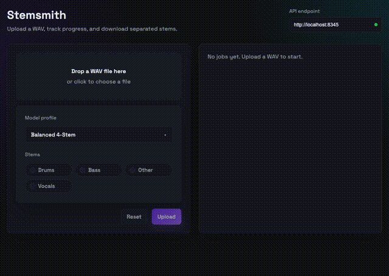

# stemsmith ⚒️
[](https://github.com/lennartkrebs/stemsmith/actions/workflows/ci.yml)
[](https://github.com/lennartkrebs/stemsmith/actions/workflows/deploy-frontend.yml)

Self-hosted Demucs stem splitting. Ships as a C++20 library, a Dockerized HTTP service (`stemsmithd`), and a small web UI. No SaaS meter, just your (hopefully fast) hardware; at least keep your wallet and let the cloud AI vendors keep charging $10000 a minute to run basically the same model faster.

<p align="center">
  
</p>

## Quick start (Docker + frontend)

- Frontend (Video): https://lennartkrebs.github.io/stemsmith (targets `http://localhost:8345` by default; configurable in the UI)
- Backend: `stemsmithd` Docker image (runs a REST API server on port 8345 by default)

```bash
# build the image (once)
docker build -t stemsmithd .

# run the server + API
docker run --rm -it -p 8345:8345 -v "$HOME/.stemsmith:/root/.stemsmith" -e OMP_NUM_THREADS=4 stemsmithd --workers=4
```
Open the UI above, upload a WAV, and download stems when done. Override port/threads/paths if needed:
```bash
docker run --rm -it -p 9000:9000 -v "$HOME/.stemsmith:/root/.stemsmith" -e OMP_NUM_THREADS=8 stemsmithd --workers=2 --port 9000 --cache-root /root/.stemsmith/cache --output-root /root/.stemsmith/output
```

CPU tips: set `OMP_NUM_THREADS` per job and balance `--workers` so `workers × threads` ≈ performance cores to avoid oversubscription.

## Build from source
```bash
git submodule update --init --recursive
cmake -S . -B build -DENABLE_OPENMP=ON
cmake --build build --target stemsmith stemsmith_test
ctest --test-dir build --output-on-failure -R stemsmith_test
```
Models download on first use into `build/model_cache`.

## Examples
- `simple_separation_example`: single job with progress to stdout
- `observer_separation_example`: two concurrent jobs with observers
- `http_server_example`: minimal REST server for separation jobs

Enable with `STEMSMITH_BUILD_EXAMPLES=ON` (default).

## API
```cpp
#include "stemsmith/stemsmith.h"
// configure cache/output roots + optional callbacks, then submit jobs
```
- Create a `runtime_config`, then `service::create(cfg)->submit(job_request)`.
- `job_request::observer` receives `job_event` callbacks per job.

Minimal usage:
```cpp
runtime_config cfg;
cfg.cache.root = "build/model_cache";
cfg.output_root = "build/output";

auto svc = stemsmith::service::create(std::move(cfg));
auto handle = (*svc)->submit({.input_path = "data/test_files/stemsmith_demo_track.wav"});
const auto result = handle->result().get();
```
